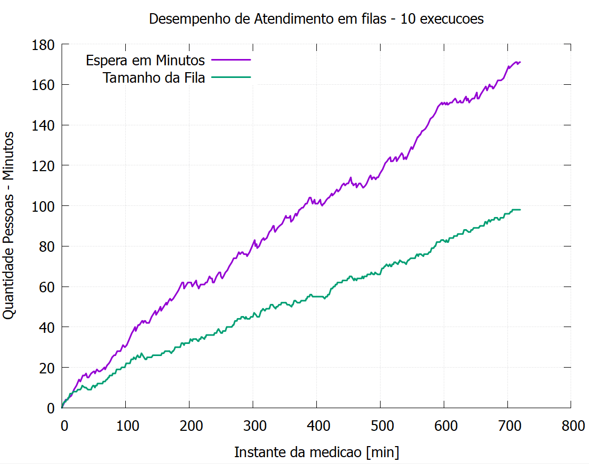
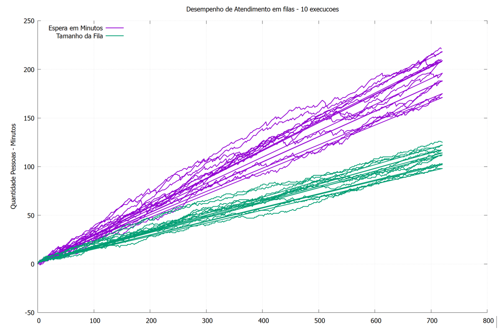
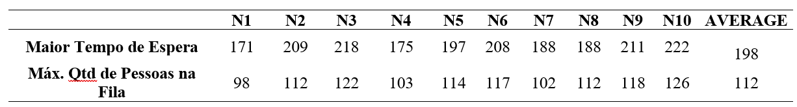
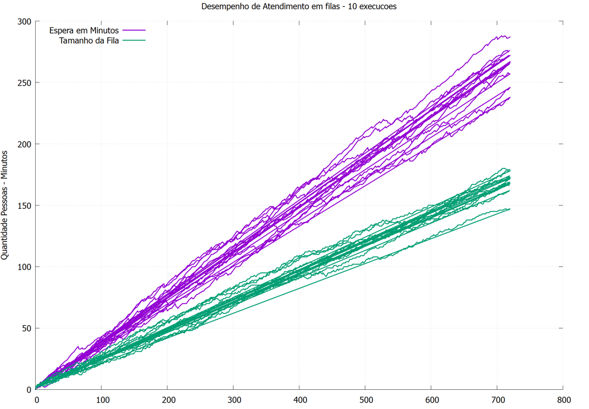
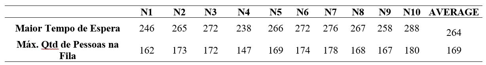

**MODELAGEM COMPUTACIONAL E AVALIAÇÃO DE EFICIENCIA DE PROCESSOS ​ - C++** :computer: 

Mestrado em Modelagem Computacional - UFF/ EEIMVR - 31/05/2024

**RESUMO**

A Pesquisa Operacional (PO) atua na análise de filas de atendimento como uma ferramenta poderosa para otimizar o fluxo de clientes, reduzir tempos de espera e melhorar a qualidade do serviço prestado. Através de modelos matemáticos, técnicas de análise e auxílio computacional, a PO permite identificar gargalos, dimensionar recursos e implementar soluções eficientes para diversos tipos de processos, como por exemplo o de filas de atendimento de um caixa de super mercados. 

**Palavras-chave**: Pesquisa Operacional; Eficiência; Estrutura de Dados; Modelagem Computacional.

**ABSTRACT**

Operations Research (OR) plays a pivotal role in analyzing waiting lines, serving as a powerful tool to optimize customer flow, reduce waiting times, and enhance service quality. Through mathematical models, analytical techniques, and computational support, OR enables the identification of bottlenecks, resource allocation, and the implementation of efficient solutions for various processes, such as supermarket checkout queues.

Keywords: Operations Research; Efficiency; Data Structures; Computational Modeling.

# **Introdução**

O estudo em questão tem por objetivo modelar computacionalmente, e avaliar, características importantes em uma fila de atendimento tais como: maior tempo de espera de um cliente e tamanho máximo da fila, durante um determinado período de operação, considerando tempos específicos para o atendimento dos clientes e incremento de novos membros na fila de atendimento.

# **Desenvolvimento**

O modelo computacional implementado na linguagem C++ consiste na utilização do Tipo Abstrato de Dados “Fila”, através do paradigma Orientado à Objetos, permitindo, de forma eficiente, simular condições de operação próxima a de uma fila real de atendimento.

## Parâmetros da simulação

Os parâmetros utilizados na simulação da fila de atendimento consistem em:

* Duração de atendimento de clientes é variável entre 1 e 4 minutos;
* Tempo de chegada de novos clientes na fila é variável entre 1 e 4 minutos;
* Médias de máximo tempo de espera e máxima quantidade de pessoas na fila são obtidas a partir de 10 execução de cada teste;
* Tempo de chegada de novos clientes na fila é variável entre 1 e 3 minutos na 2° avaliação do estudo;

# **Resultados**

A imagem a seguir exibe um gráfico contendo os resultados de tempo de espera e quantidade de pessoas na fila, avaliada a cada minuto durante 720 minutos de operação considerando intervalos aleatórios de chegada de clientes entre 1 e 4 minutos, inclusive.

 

 Gráfico 2 ‒ Gráfico de 10 execuções para Espera e Tamanho da fila com intervalo de chegada de cliente entre 1 e 4 minutos.

 

A tabela a seguir traz os valores de cada execução e as médias para o máximo tempo de espera experimento pelo cliente e a maior quantidade de pessoas na fila durante o período de 720 min.

 Tabela 1 ‒ Médias de tempo de espera e tamanho da fila 

A imagem a seguir exibe um gráfico contendo os resultados de tempo de espera e quantidade de pessoas na fila, avaliada a cada minuto durante 720 minutos de operação considerando intervalos aleatórios de chegada de clientes entre 1 e 3 minutos, inclusive.

 

 Gráfico 3 ‒ Gráfico de 10 execuções para Espera e Tamanho da fila com intervalo de chegada de cliente entre 1 e 3 minutos.

 

A tabela a seguir traz os valores de cada execução e as médias para o máximo tempo de espera experimento pelo cliente e a maior quantidade de pessoas na fila durante o período de 720 min.

 

 

Tabela 2 ‒ Médias de tempo de espera e tamanho da fila 

 

# Conclusão e Considerações Finais

De acordo com os resultados obtidos, um atendimento com duração de 1 a 4 minutos, em uma fila com tempo de chegada de novos clientes sendo entre 1 e 4 minutos, a média de maior tempo de espera que um cliente terá de enfrentar é de 198 minutos (aproximadamente 3,5 horas) e o maior tamanho de fila tem média de 112 pessoas, caso o processo ocorra por 720 minutos. Estes resultados mostram que um processo de atendimento que dura entre 1 e 4 minutos não é eficiente para prover uma experiência satisfatória para os clientes do processo em questão, sendo assim este o que podemos chamar de “gargalo” da operação, por não conseguir atender todos os clientes ao longo do tempo e de forma satisfatória.

Ainda, caso o processo experimente um aumento na frequência da chegada de clientes, passando agora para chegadas ocorrendo entre 1 e 3 minutos e mantendo a duração no atendimento, a média de maior tempo de espera que um cliente enfrenta passa a ser de 264 minutos (aproximadamente 4,4 horas) e o maior tamanho de fila passa para média de 169 pessoas, ou seja, o cliente agora experimenta um tempo de espera que é de 33% maior se comparado a situação anterior em uma fila 50% maior.

Por fim, os gráficos permitem ainda constatar que tanto o aumento no tempo de espera, quanto o aumento do tamanho da fila são proporcionais ao tempo de operação, o que mostra que a experiência insatisfatória só tende a piorar conforme o tempo de operação cresce.

 

REFERÊNCIAS

ASCENCIO, Ana Fernanda Gomes; ARAÚJO, Graziela Santos de. Estrutura de Dados. 1.ed. São Paulo: Editora PEARSON, 2010.
